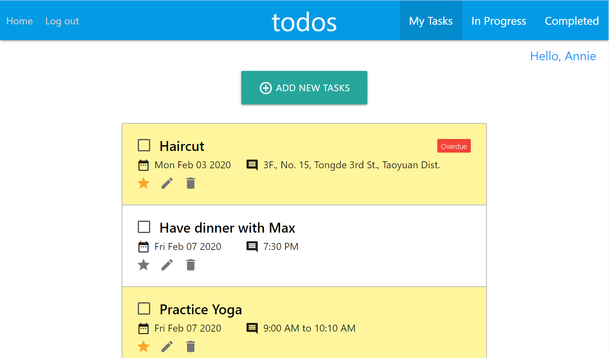

# Todo App
A todo app with CRUD functions and user authentication.

# Demo
[Live demo](https://anniekao1004.github.io/todoapp/#/)

# Backend:
   - django
   - django-rest-framework
   - django-rest-auth (token-based authentication)

# Frontend:
   - react
   - react-router
   - redux
   - react-redux
   - redux-thunk
   - axios
   - react-modal
   - react-datepicker
   - webpack

# Local setup
### Backend
- cd to Backend directory
- create and activate your virtualenv
- `pip install -r requirements.txt` to install all django dependencies
- `python manage.py migrate` to migrate database.
- `python manage.py runserver` to start django development server on <http://localhost:8000/>

### Frontend
- cd to Frontend directory
- `npm install` to install all  dependencies
- `npm run start` to start the webpack dev server on <http://localhost:3000/>
